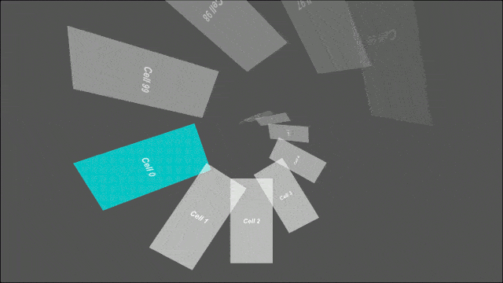
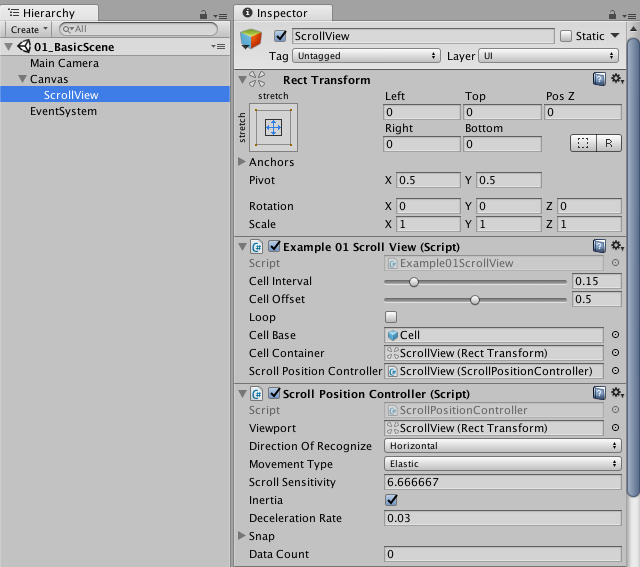
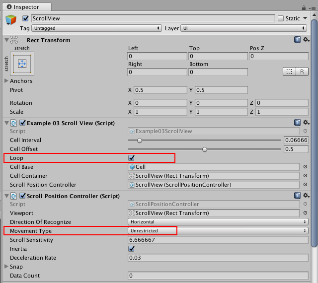

# FancyScrollView [](http://mit-license.org)
高度に柔軟なアニメーションを実装できる汎用のScrollViewコンポーネントです。 無限スクロールも対応しています。[English](https://translate.google.com/translate?sl=ja&tl=en&u=https://github.com/setchi/FancyScrollView) (by Google Translate)





## 仕組み
FancyScrollView はセルの位置を更新する際に、画面に見える範囲を正規化した値を各セルに渡します。セル側では 0.0 ~ 1.0 の値をもとにスクロール中の見た目を自由に制御できます。

## 使い方
もっともシンプルな構成では、

- セルにデータを渡すためのオブジェクト
- スクロールビュー
- セル

の実装が必要です。

### スクリプトの実装
セルにデータを渡すためのオブジェクトを定義します。
```csharp
public class MyCellDto
{
    public string Message;
}
```
FancyScrollView を継承して自分のスクロールビューを実装します。

```csharp
using UnityEngine;
using System.Linq;
using FancyScrollView;

public class MyScrollView : FancyScrollView<MyCellDto>
{
    [SerializeField]
    ScrollPositionController scrollPositionController;

    void Awake()
    {
        base.cellData = Enumerable.Range(0, 50)
            .Select(i => new MyCellDto { Message = "Cell " + i })
            .ToList();

        scrollPositionController.SetDataCount(base.cellData.Count);
        scrollPositionController.OnUpdatePosition(base.UpdatePosition);
    }
}
```
FancyScrollViewCell を継承して自分のセルを実装します
```csharp
using UnityEngine;
using UnityEngine.UI;
using FancyScrollView;

public class MyScrollViewCell : FancyScrollViewCell<MyCellDto>
{
    [SerializeField]
    Text message;

    public override void UpdateContent(MyCellDto itemData)
    {
        message.text = itemData.Message;
    }

    public override void UpdatePosition(float position)
    {
        // position は 0.0 ~ 1.0 の値です
        // position をもとに、セルの見た目を自由に制御できます
    }
}
```
### インスペクタ上の設定

#### My Scroll View
| プロパティ | 説明 |
|:-----------|:------------|
|Cell Interval|セル同士の間隔を float.Epsilon ~ 1.0 の間で指定します。|
|Cell Offset|セルのオフセットを指定します。例えば 0.5 を指定して、スクロール位置が 0 の場合、最初のセルの位置が 0.5 になります。|
|Loop|オンにすると、セルをループして配置します。無限スクロールさせたい場合はオンにします。|
|Cell Base|セルの Prefab を指定します。|
|Cell Container| セルの親要素となる Transform を指定します。 |

#### Scroll Position Controller
| プロパティ | 説明 |
|:-----------|:------------|
|Viewport|ビューポートとなる RectTransform を指定します。ここで指定された RectTransform の範囲内でジェスチャーの検出を行います。|
|Direction Of Recognize|ジェスチャーを認識する方向を Vertical か Horizontal で指定します。|
|Movement Type|コンテンツがスクロール範囲を越えて移動するときに使用する挙動を指定します。|
|Scroll Sensitivity|スクロールの感度を指定します。|
|Inertia|慣性のオン/オフを指定します。|
|Deceleration Rate|Inertia がオンの場合のみ有効です。減速率を指定します。|
|Snap - Enable|Snap を有効にする場合オンにします。|
|Snap - Velocity Threshold|Snap がはじまる閾値となる速度を指定します。|
|Snap - Duration|Snap 時の移動時間を秒数で指定します。|
|Data Count|アイテムのデータ件数の総数です。基本的にスクリプトから設定します。|

## Q&A

#### データ件数が多くてもパフォーマンスは大丈夫？
セルは表示に必要な数のみ生成するので、データ件数がパフォーマンスに与える影響は小さいです。
データ件数よりも、セル同士の間隔（同時に存在するセルの数）やセルの演出の方が、パフォーマンスに与える影響は大きいです。

#### 自分でスクロール位置を制御したいんだけど？
スクロール位置は自由に制御できます。サンプルで使用している ScrollPositionController は独自の実装に置き換えることができます。

#### セルで発生したイベントを受け取れる？
セルで発生したあらゆるイベントをハンドリングできます。
セルで発生したイベントをハンドリングする実装例（[Examples/02_CellEventHandling](https://github.com/setchi/FancyScrollView/tree/master/Assets/FancyScrollView/Examples/02_CellEventHandling)）を含めているので、これを参考に実装してください。

#### セルを無限スクロール（ループ）させたいんだけど？
無限スクロールに対応しています。実装手順は下記の通りです。
1. ScrollView の「Loop」をオンにすると、セルがループ状に配置されます。
1. サンプルで使用している ScrollPositionController を使う場合は、「Movement Type」を「Unrestricted」に設定することで、スクロール範囲が無制限になります。



実装例（[Examples/03_InfiniteScroll](https://github.com/setchi/FancyScrollView/tree/master/Assets/FancyScrollView/Examples/03_InfiniteScroll)）を含めているのでこちらも参考にしてください。

## 開発環境
Unity 2017.2.0f3

## LICENSE
MIT
